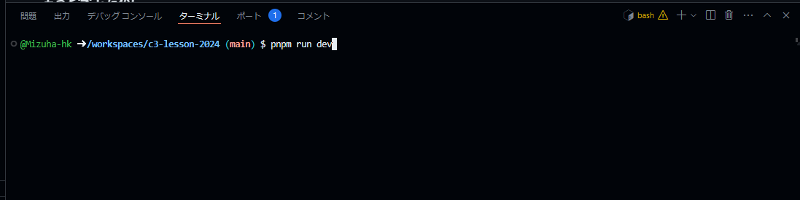
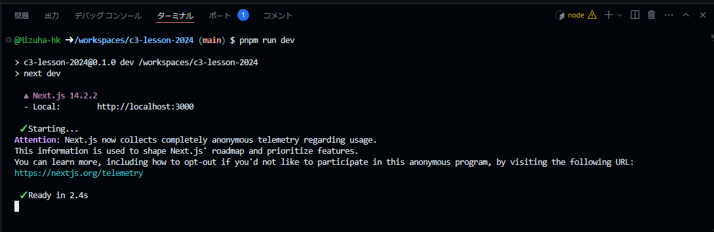
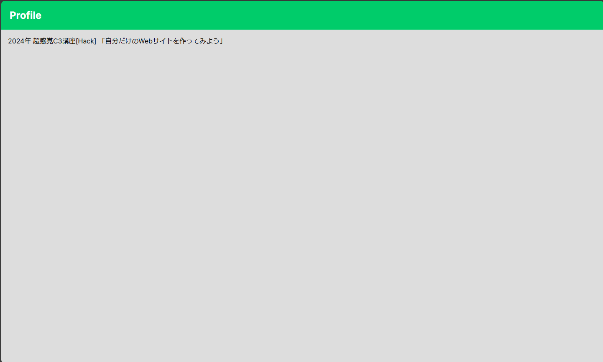
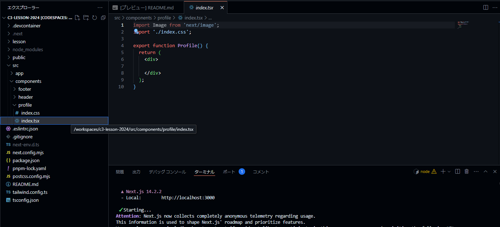
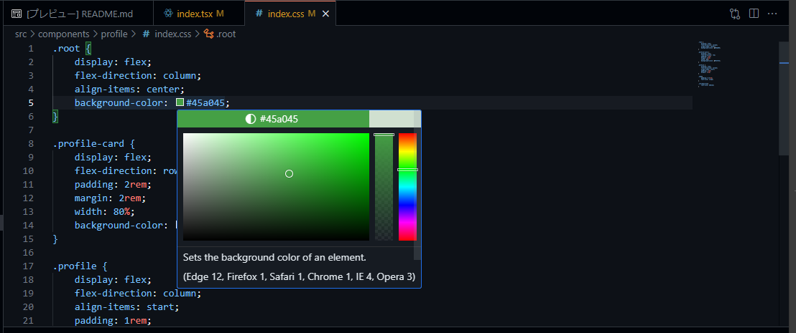

# 超感覚C3講座(Hack)

## はじめに
まずはじめに，この講座のコンセプトを話していきたいと思います．この講座は，**とりあえず作って雰囲気を味わう**ことを目標としています．

Webアプリの開発では，大まかに，見た目をつくる**フロントエンド**と複雑な処理を行う**バックエンド**のように分かれています．フロントエンドの中でも，ただ見た目を整えるだけでなく，ロジック(ボタンを押したら，ほかのページに移動したり，サーバーから情報を取ってきたりする部分)を作ったりします．

これを初めから手を出そうとすると，**インプット量が非常に多くなってしまいます**．そのため，今回はこちらが用意したひな形をベースに，自分の自己紹介サイトのような簡単なものですが，今後につながるよう本格的なツール(フレームワーク)を使って作って行こうと思います．

完成したサイトの例


## 使用するフレームワーク，ツールについて

GitHub Codespacesは重要ですが，その他のツールについては読み飛ばしても大丈夫です．

### GitHub Codespaces (重要)
本来であれば，どんなアプリの開発であっても，そのアプリを開発するためのツールであったり，エンジンを作業するパソコンにインストールする作業が必要です．

これが**環境構築**というものです．

しかし，はじめてプログラミング等に触れる場合，この環境構築が大きなハードルとなってしまいます．どのツールをどうやって入れたらいいのか，どのバージョンを入れなきゃいけないのか調べることも大変ですし，インストールする際にエラーが出たらどう対処したらいいのかがわからないといった問題に直面する場合があります．この環境構築を簡単にするために，GitHub Codespacesというサービスを利用します．

このサービスを超簡単に説明すると，開発に必要なツールを書き出したファイルをGitHubが見て，そのツールが入ったパソコンを用意してくれるというサービスです．その用意されたパソコンを私たちが遠隔操作するので，自分のパソコンにツール等を入れる必要がないということです．この構成ファイルは，この講座資料に既に入っているため，今回の場合は環境構築については何も考えなくて大丈夫です．

### Next.js
React.jsというツールをベースに作られた，Webアプリを効率的に作成できるフレームワーク．より複雑な機能をNext.jsが簡単に使えるようにしてくれているため，人気のあるフレームワーク．

今回はNext.jsとTypeScriptという言語を使って開発をしますが，TypeScriptの中にHTMLを直接書いていくことになるので，TypeScriptの知識は不要です．

## 作業開始

### 1. リポジトリをフォークする

まず，講座資料として用意したひな形のコード全体(リポジトリ)を自分のアカウントへコピー(フォークする)します．

[こちら](https://github.com/Mizuha-hk/c3-lesson-2024/tree/main)のサイトの画面右上の`fork`というボタンをクリックして，`Create Fork`ボタンをクリック．


これでフォークは完了です．

### 2. Codespacesを開く

次に，GitHub Codespacesを立ち上げます．`Code`ボタンをクリックして，`Codespaces`のタブを開き，`+`ボタンをクリックします．


しばらく待つと，Codespacesが立ち上がり，コードに変更を加えることができるようになります．


### 3. ひな形のWebサイトを起動してみる

画面下のターミナルの部分をクリックし，`pnpm run dev`と入力してEnterキーを押します．この`pnpm run dev`が，アプリを起動するコマンドになっています．



すると，以下のように表示されるので，`http://localhost:3000`と書いてある部分を`Ctrl`キーを押しながらクリックします．


すると，以下のように，ひな形のアプリが表示されます．



Next.jsでは，このコマンドで起動しっぱなしにしておけば，ファイルを書き換えた際に，リアルタイムで変更が適応されるので，現在のコードではどんな見た目になっているのか確認しながら開発を行うことができます．

Webサイトを止めたいときは，ターミナルをクリックして，`Ctrl`+`C`キーの同時押しで止めることができます．

### 4. 作業するファイルの確認

今回の講座で編集するファイルを確認します．

画面右側のエクスプローラーから，`src`->`components`->`profile`の順にクリックしていくと，`index.tsx`と`index.css`が現れます．今回は，この2つのファイルを編集していきます．それぞれクリックすると，ファイルの中身を見ることができます．



### 5. 大まかな構造を記述する

ここからコードを書いていきます．

まず，完成品はどういう構造になっているかを確認すると，

1. 背景部分の中に，自己紹介カード全体が入っている．
2. 自己紹介カード全体の中に，「プロフィール画像」と「名前+自己紹介文」が横並びに入っている．
3. 「名前+自己紹介文」の中は「名前」と「自己紹介文」が縦並びに入ってる


この包含関係を`<div>`タグで指定すると，`index.tsx`は以下のようになる．

```tsx
import Image from 'next/image';
import './index.css';

export function Profile() {
  return (
    <div>
      <div>
        プロフィール画像
        <div>
            名前
            自己紹介文
        </div>
      </div>
    </div>
  );
}
```

このままでは，「名前」と「自己紹介文」が同じ要素として扱われるので，
名前の部分は`<h1>`タグ，自己紹介文は`<p>`タグで囲む

```tsx
import Image from 'next/image';
import './index.css';

export function Profile() {
  return (
    <div>
      <div>
        プロフィール画像
        <div>
            <h1>名前</h1>
            <p>自己紹介文</p>
        </div>
      </div>
    </div>
  );
}
```

最後に，画像を挿入していきます．「プロフィール画像」の部分を`<Image>`コンポーネントというものに置き換えると，画像を挿入することができます．

以下のように置き換えます．
```tsx
<Image src="/sample1.jpg" width={300} height={300} alt="profile" />
```
意味を簡単に説明します．

`src="/sample1.jpg"`: 

挿入する画像を指定しています．この場合，publicフォルダの中にあるsample1.jpgという画像ファイルを指定しています．

`width={300} height={300}`:

画像の大きさを幅300px, 高さ300pxに指定しています．

`alt="profile"`:

何らかの原因で画像ファイルが読み込めない場合，profileという文字が表示されるようになります．

画像ファイルがまとめてあるpublicフォルダの中には`sample1.jpg`から`sample4.jpg`まで用意してるので，自由に画像を指定して見てください．また，publicフォルダに，自前で用意した好きな画像を入れて，`src="/ファイル名"`のようにファイル名を指定すると，その画像を挿入できます．

置き換えた結果の`index.tsx`は以下のようになります．

```tsx
import Image from 'next/image';
import './index.css';

export function Profile() {
  return (
    <div>
      <div>
        <Image src="/sample1.jpg" width={300} height={300} alt="profile" />
        <div>
            <h1>名前</h1>
            <p>自己紹介文</p>
        </div>
      </div>
    </div>
  );
}
```

### 6. CSSで見た目を整える準備をする

このままでは，まだ各要素が縦に並んだだけになっているはずです．見た目を整えるにはCSSファイルを記述します．しかし，このままでは各要素に名前が付いていないので，どの要素を縦並びにするのか，横並びにするかを指定することができません．そこで，各タグの中に`className="名前"`のように記述して，要素に名前を付けていきます．名前を付けた`index.tsx`を以下に示します．

```tsx
import Image from 'next/image';
import './index.css';

export function Profile() {
  return (
    <div className="root">
      <div className="profile-card">
        <Image src="/sample1.jpg" width={300} height={300} alt="profile" />
        <div className="profile">
          <h1 className="name">名前</h1>
          <p className="introduction">自己紹介文</p>
        </div>
      </div>
    </div>
  );
}
```

> 名前は自由に付けられますが，本講座資料では，上記のように記述した前提のソースコードを示します．

### 7. レイアウトを指定する

では，`index.css`を開き，以下のように記述します．

```css
.root {

}

.profile-card {

}

.profile {

}

.name{

}

.introduction{

}
```

この`{}`の中に，指定した要素をどのような見た目にしたいかを記述します．

自己紹介カードの中身の「プロフィール画像」と「名前+自己紹介文」は横並びにしたいので，以下のように記述します．

```css
.profile-card {
    display: flex;
    flex-direction: row;
}
```

また，自己紹介カード全体は中央揃えにしたいので，.rootの中身を以下のように記述することで，中央揃えにできます．

```css
.root{
    display: flex;
    flex-direction: column;
    align-items: center;
}
```

名前と自己紹介文は左寄せにしたいので，以下のように記述すると，左寄せにできます．

```css
.profile{
    display: flex;
    flex-direction: column;
    align-items: start;
}
```

これで大まかなレイアウト指定は終わりです．

### 8. 余白を取る，大きさを指定する

このままでは，各要素がぴったりくっついて窮屈なので，十分な余白を取ろうと思います．余白を取るには，`padding`や`margin`といったプロパティに，数値を指定します．それぞれの違いは以下の通りです．

|プロパティ名|説明|
|:-:|:-:|
|padding|指定した大きさだけ，要素そのものを大きくする|
|margin|要素そのものの大きさは変えず，指定した大きさだけ他の要素から距離を取る|


これらプロパティにより，余白を取った場合，以下のようになります．これはあくまで一例であり，もっと幅を取りたかったり，逆に狭くしたかったりした場合は，数値を小さくしても大丈夫です．

```css
.root {
    display: flex;
    flex-direction: column;
    align-items: center;
}

.profile-card {
    display: flex;
    flex-direction: row;
    padding: 2rem;
    margin: 2rem;
}

.profile {
    display: flex;
    flex-direction: column;
    align-items: start;
    padding: 1rem;
    margin: 1rem;
}

.name{
    padding: 0.5rem;
}

.introduction{

}
```

ここで，`rem`という単位について補足します．上記のサンプルコードで，`padding`や`margin`の大きさ指定に`rem`という単位を使っています．これは，1文字の大きさを基準として，何文字分の幅を取るかという単位になっています．もちろん，`px`といった単位で指定しても大丈夫です．CSSで使える単位について，以下にまとめます．

#### 絶対的な長さの単位:
1. cm（センチメートル）: 1cm = 96px/2.54
2. mm（ミリメートル）: 1mm = 1/10 cm
3. in（インチ）: 1in = 2.54cm = 96px
4. px（ピクセル）: 画面出力に向いています。
#### 相対的な長さの単位:
1. em: 親要素のフォントサイズに対する相対的なサイズ。
2. rem: ルート要素のフォントサイズに対する相対的なサイズ。
3. vw: 画面サイズ幅の1%。
4. vh: 画面サイズ高さの1%。

次に，自己紹介カード全体を制限しようと思います．このままだと，自己紹介文が長くなった場合，自己紹介カードが画面からはみ出したりしてしまいます．横幅を指定したいときは，`width`,高さを指定したい場合は，`height`を使います．今回は`width`のみ使います．

```css
.profile-card {
    display: flex;
    flex-direction: row;
    padding: 2rem;
    margin: 2rem;
    width: 80%;
}
```

このように，親要素(今回はroot)の何%の大きさのような指定方法もできます．

では次に，文字の大きさを指定します．文字の大きさは`font-size`を使用して指定します．`padding`や`margin`のように，`px`で指定することもできますが，文字の大きさに関しては，`large`や`small`といったキーワードが使えます．

名前と自己紹介文の文字の大きさを指定したコードは以下の通りです．

```css
.name{
    font-size: large;
    padding: 0.5rem;
    border-bottom: 1px solid #999999;
}

.introduction{
    font-size: medium;
}
```
### 9. 色の指定

では最後に，背景色を付けたいと思います．背景に色を付ける場合は，`background-color`を使います．色の指定方法はいくつかあり，あらかじめ用意された色を使う方法や，カラーコードを使う方法などがあります．今回はカラーコードを使います．背景色を入れたコードは以下の通りです．

```css
.root {
    display: flex;
    flex-direction: column;
    align-items: center;
    background-color: #d0e0d0;
}

.profile-card {
    display: flex;
    flex-direction: row;
    padding: 2rem;
    margin: 2rem;
    width: 80%;
    background-color: #fefefe;
}
```

この時，カラーコードの左に色のサンプルが表示されますが，それにマウスカーソルを合わせると，カラーピッカーが開いて，簡単に色の指定ができるので，それを使うと簡単に色の指定ができます．




**これで今回の講座内容は以上です．後は好きに数値や色をいじって遊んでみてください．**