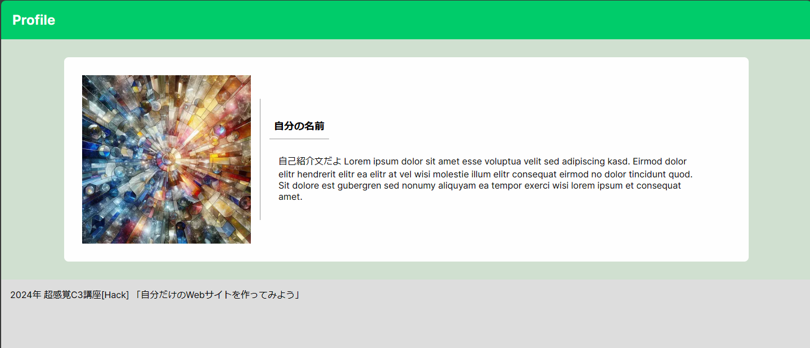
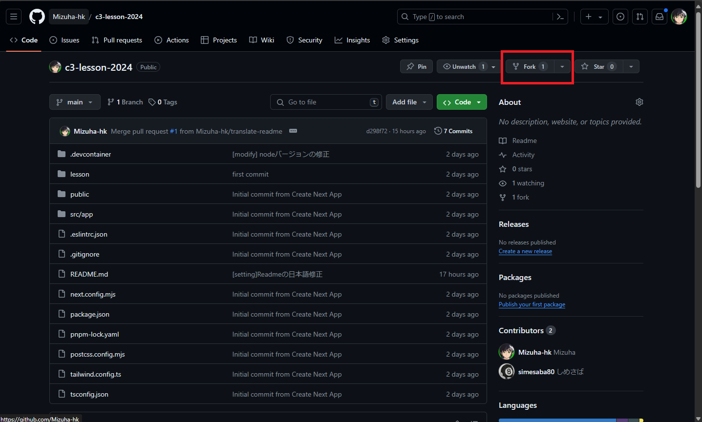
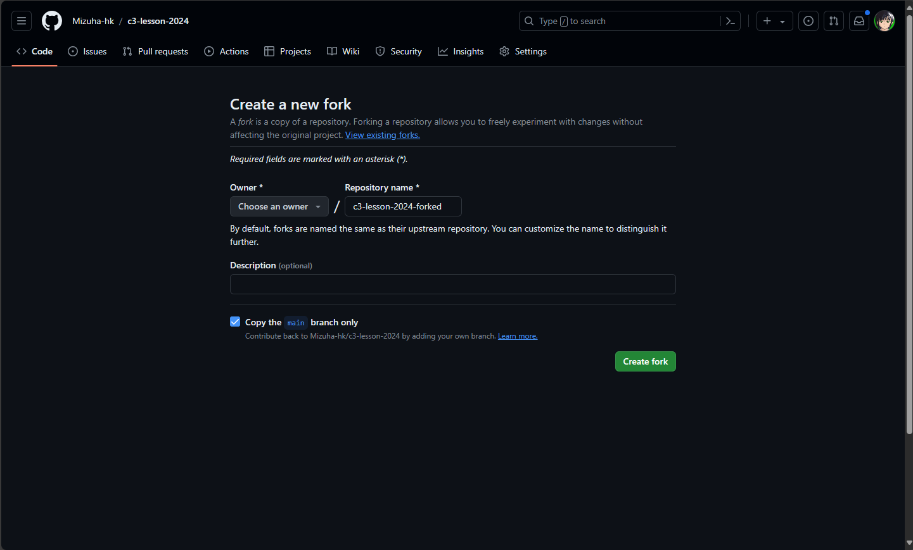
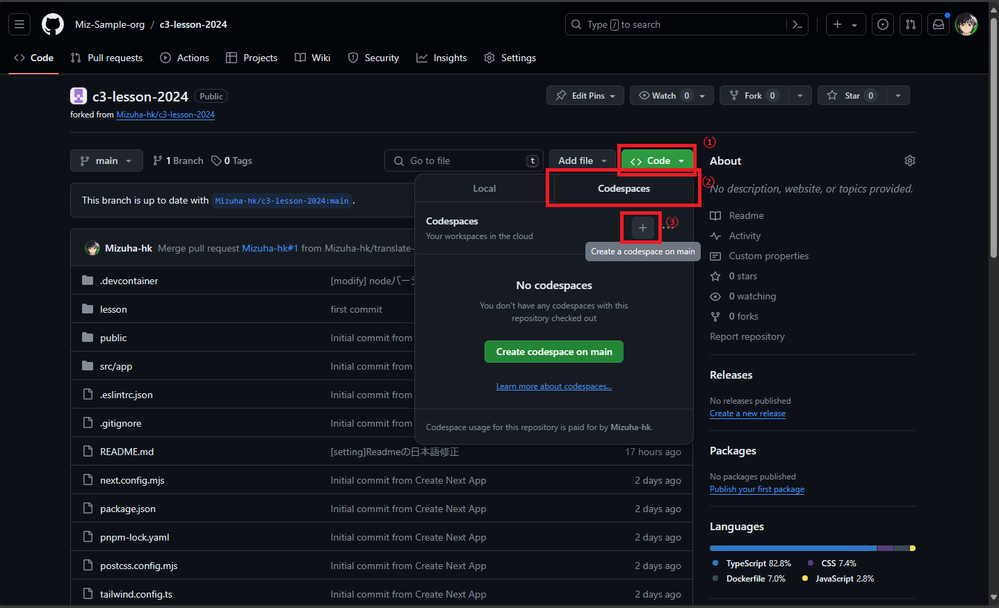
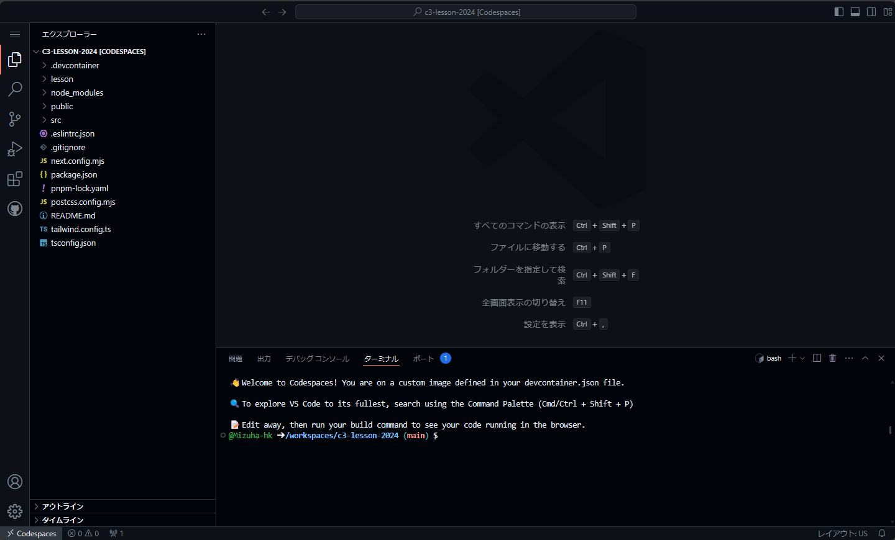

# 超感覚C3講座(Hack)

## はじめに
まずはじめに，この講座のコンセプトを話していきたいと思います．この講座は，**とりあえず作って雰囲気を味わう**ことを目標としています．

Webアプリの開発では，大まかに，見た目をつくる**フロントエンド**と複雑な処理を行う**バックエンド**のように分かれています．フロントエンドの中でも，ただ見た目を整えるだけでなく，ロジック(ボタンを押したら，ほかのページに移動したり，サーバーから情報を取ってきたりする部分)を作ったりします．

これを初めから手を出そうとすると，**インプット量が非常に多くなってしまいます**．そのため，今回はこちらが用意したひな形をベースに，自分の自己紹介サイトのような簡単なものですが，今後につながるよう本格的なツール(フレームワーク)を使って作って行こうと思います．

完成したサイトの例

## 使用するフレームワーク，ツールについて

GitHub Codespacesは重要ですが，その他のツールについては読み飛ばしても大丈夫です．

### GitHub Codespaces (重要)
本来であれば，どんなアプリの開発であっても，そのアプリを開発するためのツールであったり，エンジンを作業するパソコンにインストールする作業が必要です．

これが**環境構築**というものです．

しかし，はじめてプログラミング等に触れる場合，この環境構築が大きなハードルとなってしまいます．どのツールをどうやって入れたらいいのか，どのバージョンを入れなきゃいけないのか調べることも大変ですし，インストールする際にエラーが出たらどう対処したらいいのかがわからないといった問題に直面する場合があります．この環境構築を簡単にするために，GitHub Codespacesというサービスを利用します．

このサービスを超簡単に説明すると，開発に必要なツールを書き出したファイルをGitHubが見て，そのツールが入ったパソコンを用意してくれるというサービスです．その用意されたパソコンを私たちが遠隔操作するので，自分のパソコンにツール等を入れる必要がないということです．この構成ファイルは，この講座資料に既に入っているため，今回の場合は環境構築については何も考えなくて大丈夫です．

### Next.js
React.jsというツールをベースに作られた，Webアプリを効率的に作成できるフレームワーク．より複雑な機能をNext.jsが簡単に使えるようにしてくれているため，人気のあるフレームワーク．

## 作業開始

### 1. リポジトリをフォークする

まず，講座資料として用意したひな形のコード全体(リポジトリ)を自分のアカウントへコピー(フォークする)します．

[こちら](https://github.com/Mizuha-hk/c3-lesson-2024/tree/main)のサイトの画面右上の`fork`というボタンをクリックして，`Create Fork`ボタンをクリック．

これでフォークは完了です．

### 2. Codespacesを開く

次に，GitHub Codespacesを立ち上げます．`Code`ボタンをクリックして，`Codespaces`のタブを開き，`+`ボタンをクリックします．

しばらく待つと，Codespacesが立ち上がり，コードに変更を加えることができるようになります．

### 3. ひな形のアプリを起動してみる

